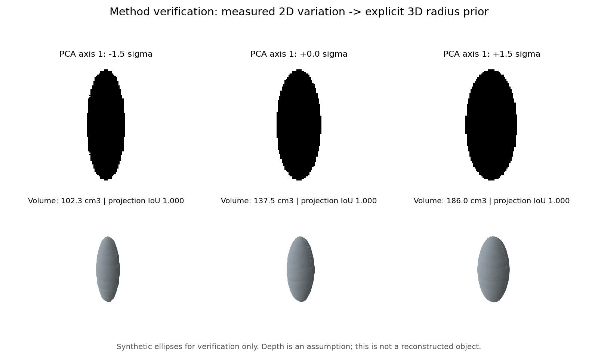

# Verification record

Verified on 2026-10-02, Python 3.12. CPU inference and geometry; this is an implementation check, not validation of universal object rules or reconstruction accuracy.

## Automated checks

14 tests passed: deduplication preserves morphology variants; centre/scale alignment; known synthetic groups; seed repeatability; constant-feature fallback; PCA variation affects geometry; projection preservation and closed volume across three depth assumptions; GLB metre scaling; mask fingerprint invalidation; ZIP/CLI reproduction of the same silhouette and geometry; empty-mask failure logging; alpha masks without network; Streamlit full pipeline, review selection across pages, all three synthesis modes.

## Real image smoke runs

Wikimedia Commons returned 16 candidates per query. Exclude masks flagged for border contact or large discarded regions before analysis. Search membership and automatic segmentation were not manually verified; these counts are execution evidence, not recognition accuracy. Gargoyle input had one extraction failure.

| Query | Valid masks | Quality-accepted | Groups | Silhouette | Subsample ARI | Held-out mask IoU | Mean-only IoU | Closed mesh | Projection IoU |
|---|---:|---:|---:|---:|---:|---:|---:|---|---:|
| gargoyles | 15 | 9 | 2 | 0.286 | 0.865 | 0.645 | 0.432 | True | 1.000 |
| cats | 16 | 12 | 2 | 0.201 | 0.849 | 0.726 | 0.588 | True | 1.000 |
| dogs | 16 | 14 | 2 | 0.357 | 0.894 | 0.675 | 0.536 | True | 1.000 |

Projection IoU checks preservation of the generated silhouette under the depth prior, not similarity to an unknown real 3D object. Held-out PCA reconstruction is conditional on the held-out 2D field; it is not unconditional image generation.

## Optional feature backends

CPU DINOv2-small produced 16×384 embeddings and CLIP ViT-B/32 produced 16×512 embeddings on the cat candidate set. Both completed grouping; the automatic criterion kept one group in that smoke run. This is an honest weak-partition fallback, not a failed interface or forced semantic clustering. Core requirements do not install these larger models.

## Provider and rendering limits

Commons search and image download were exercised successfully. Openverse returned HTTP 403 in this environment; its integration reports the failure without substituting unrelated images. Streamlit interactions were tested through AppTest. Browser screenshots were unavailable because the browser binary download failed; no claim of browser visual QA is made.

This figure uses synthetic verification inputs. It is not a proposed design.
