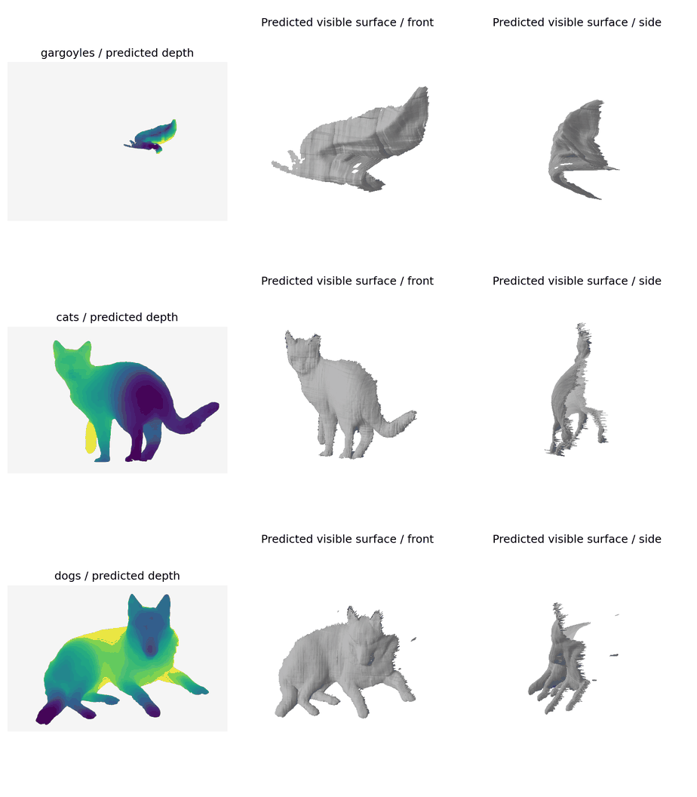

# Depth upgrade verification · 2.1

Verified on 2026-10-02, Python 3.12, CPU. This is execution, topology and reproducibility evidence, **not ground-truth 3D accuracy**.

## Automated checks

25 tests cover the previous pipeline and depth-aware grouping, camera backprojection, internal depth variation with an identical silhouette, occlusion cuts, source colours and GLB units, shell topology/thickness, point-contact splitting, model/mask-bound cache reuse and corruption recovery, source-mask position invalidation, whole-cohort and single-image depth ZIP/CLI replay without inference, and Streamlit depth controls. CI uses synthetic depth fixtures and does not download foundation-model weights.

## Real inference

MoGe-2 Base (`Ruicheng/moge-2-vitb-normal`, revision `ca5f0e07ff01d3e5a364c1d954ed12ee1814b368`), maximum dimension 768, resolution level 9, fp32 CPU, discontinuity threshold 0.03. Representative surfaces are full-resolution predictions; no geometry smoothing or generative appearance is added.

| Dataset | Analysed images | Stable groups | Median inference seconds | Representative vertices | Representative triangles | 2 mm shell closed | Shell components |
|---|---:|---:|---:|---:|---:|---|---:|
| Gargoyle candidate PNGs | 9 | 1 | 8.67 | 9,813 | 18,955 | True | 1 |
| Cat photographs | 12 | 1 | 8.53 | 109,176 | 215,479 | True | 1 |
| Curated dog photographs | 8 | 1 | 8.43 | 124,631 | 246,289 | True | 7 |

Median inference timings are local measurements, including first loading where applicable, not a deployment SLA. Resizing/meshing/ZIP timings are separate. High vertex counts sample predicted fields; they do not prove that the network recovered equally many independent surface details.

The original automatic quality flags excluded masks before inference. Dog review additionally excluded a child with a dog, a dhole outside the domestic-dog scope, nursing puppies, a multiple-dog image, dogs with sheep, and a painting whose foreground contained people. Excluded IDs and original metadata are recorded in [depth_validation_metrics.json](depth_validation_metrics.json) and [depth_validation_exclusions.json](depth_validation_exclusions.json). These are exploratory candidates, not a certified benchmark.

Gargoyle images came from the previous local PNG collection. Its original Commons page metadata was lost when that folder was exported; this source-provenance gap is recorded rather than reconstructed from guesses. It can verify inference execution, but should not be reused as a publication dataset until provenance is recovered. Cat/dog source metadata remains in the experiment records.

All three automatic partitions retained one group after the stability rule. This is a weak partition result, not evidence of a universal category grammar. More coherent views, better segmentation and additional images are required before interpreting multiple shape types.

Left: predicted depth, normalised within the foreground. Centre/right: the predicted visible surface. Source photographs are omitted from this repository figure. Cat example: [Felis catus-cat on snow](https://commons.wikimedia.org/wiki/File:Felis_catus-cat_on_snow.jpg), Von.grzanka, CC BY-SA 3.0. Dog example: [20110425 German Shepherd Dog 8505](https://commons.wikimedia.org/wiki/File:20110425_German_Shepherd_Dog_8505.jpg), Jakub Hałun, CC BY-SA 4.0. Corresponding input IDs are in the metrics record.

The side views expose the central limitation: one photograph yields an estimated visible surface, not a complete 360° animal. Foreground edges, fur, thin structures and occlusion cuts can produce jagged or disconnected patches. The dog's seven closed shell components must not be described as a single fabrication-ready solid. Added shell thickness changes topology, not the amount of observed 3D information.

Small was also exercised on 35 automatically quality-accepted candidates at 512/level 6. Depth Anything V2 Small was exercised on a real gargoyle and cat, including the saved raw-disparity path. MoGe-2 Large and CUDA inference are implemented but not exercised. Base and Depth Anything algorithm-2 arrays (including predicted normals or raw disparity) were serialized and decoded in a real cat smoke test.

## Reproduction and limits

Run `python scripts/validate_depth.py --experiments /path/gargoyles.zip /path/cats.zip /path/dogs.zip --model moge-base --max-size 768 --detail 9 --exclude-map docs/depth_validation_exclusions.json --output /path/results`. The exclusion-map keys match the original folder names (`verified_gargoyles`, `verified_cats`, `verified_dogs`). Original input archives and model weights are not bundled. Existing experiment ZIPs carry arrays for offline CLI reproduction.

`python -m pip check` reports no broken requirements in the tested runtime. MoGe's fp32 postprocessing emits an upstream CPU-autocast warning; inference completes in fp32. Runtime revisions and checkpoint revisions are pinned separately. Browser visual QA and the user's hosted Streamlit deployment have not been exercised; UI interactions were verified with AppTest and the scientific surface figure was inspected.

---

# Verification record · 2.0 baseline

Verified on 2026-10-02, Python 3.12. CPU inference and geometry; this is an implementation check, not validation of universal object rules or reconstruction accuracy.

## Automated checks

14 tests passed: deduplication preserves morphology variants; centre/scale alignment; known synthetic groups; seed repeatability; constant-feature fallback; PCA variation affects geometry; projection preservation and closed volume across three depth assumptions; GLB metre scaling; mask fingerprint invalidation; ZIP/CLI reproduction of the same silhouette and geometry; empty-mask failure logging; alpha masks without network; Streamlit full pipeline, review selection across pages, all three synthesis modes.

## Real image smoke runs

Wikimedia Commons returned 16 candidates per query. Exclude masks flagged for border contact or large discarded regions before analysis. Search membership and automatic segmentation were not manually verified; these counts are execution evidence, not recognition accuracy. Gargoyle input had one extraction failure.

| Query | Valid masks | Quality-accepted | Groups | Silhouette | Subsample ARI | Held-out mask IoU | Mean-only IoU | Closed mesh | Projection IoU |
|---|---:|---:|---:|---:|---:|---:|---:|---|---:|
| gargoyles | 15 | 9 | 2 | 0.286 | 0.865 | 0.645 | 0.432 | True | 1.000 |
| cats | 16 | 12 | 2 | 0.201 | 0.849 | 0.726 | 0.588 | True | 1.000 |
| dogs | 16 | 14 | 2 | 0.357 | 0.894 | 0.675 | 0.536 | True | 1.000 |

Projection IoU checks preservation of the generated silhouette under the depth prior, not similarity to an unknown real 3D object. Held-out PCA reconstruction is conditional on the held-out 2D field; it is not unconditional image generation.

## Optional feature backends

CPU DINOv2-small produced 16×384 embeddings and CLIP ViT-B/32 produced 16×512 embeddings on the cat candidate set. Both completed grouping; the automatic criterion kept one group in that smoke run. This is an honest weak-partition fallback, not a failed interface or forced semantic clustering. Their runtime is now included by the depth upgrade; weights are downloaded only when used.

## Provider and rendering limits

Commons search and image download were exercised successfully. Openverse returned HTTP 403 in this environment; its integration reports the failure without substituting unrelated images. Streamlit interactions were tested through AppTest. Browser screenshots were unavailable because the browser binary download failed; no claim of browser visual QA is made.

This figure uses synthetic verification inputs. It is not a proposed design.
